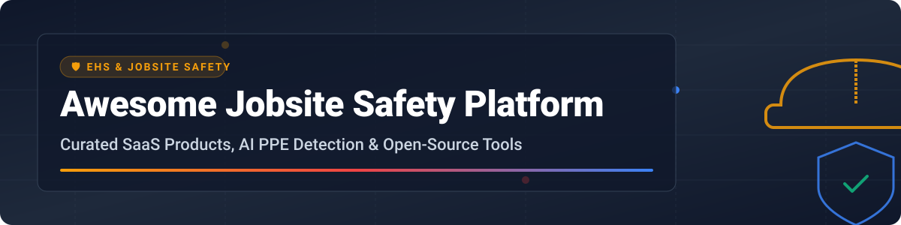

  

# 🏗️ Awesome Jobsite Safety Platform 🛡️

  
  
  
  
  

> 🚨 A curated list of top SaaS products, enterprise construction safety software platforms, and open-source GitHub projects for jobsite safety management, PPE compliance monitoring, worker inductions, OSHA reporting, and AI computer vision site safety analytics.

📅 **Last updated: September 2026**

---

## 📌 Table of Contents

- [📊 Market & Industry Overview](#-market--industry-overview)
- [🏢 SaaS / Enterprise Safety Platforms](#-saas--enterprise-safety-platforms)
- [🔓 Open-Source GitHub Projects](#-open-source-github-projects)
- [🤝 How to Contribute](#-how-to-contribute)
- [💖 Support & Sponsoring](#-support--sponsoring)
- [📈 Star History](#-star-history)
- [⚠️ Disclaimer](#%EF%B8%8F-disclaimer)

---

## 📊 Market & Industry Overview

> 💡 **Market Size & Fragmentation:** The global Construction Safety Software & EHS market is estimated at **$2.1 Billion** (2026) and is projected to reach **$3.8 Billion** by 2031 (CAGR ~12.5%). The sector is **moderately fragmented**: anchored by enterprise construction management suites (e.g., Procore, SafetyCulture) alongside specialized high-growth vertical SaaS point solutions (HammerTech, Safesite) and niche AI computer vision hardware/software entrants (Intenseye, Smartvid.io/Vinnie).

---

## 🏢 SaaS / Enterprise Safety Platforms

Below is a comparison of top commercial jobsite safety platforms, ranked in descending order by estimated enterprise valuation / revenue size:

| Platform | Company Size (Est. Valuation / Revenue) | Starting Tier Price | Free Tier / Trial Limits | Key Safety Features & Capabilities |
| :--- | :--- | :--- | :--- | :--- |
| 🏗️ **[Procore Safety](https://www.procore.com/)** | **~$10.5B Valuation** ($1.1B+ ARR) | $375 / month (custom annual tier) | 14-day sales demo trial | Integrated quality & safety module within Procore suite; site observations, incident tracking, OSHA 300 logs. |
| 📋 **[SafetyCulture (iAuditor)](https://safetyculture.com/)** | **~$1.7B Valuation** ($150M+ ARR) | $24 / user / month (billed annually) | **Forever Free**: Up to 10 users & 5 active inspection templates | Mobile-first safety inspections, audit checklists, hazard observation reporting, and corrective action workflows. |
| 🔨 **[HammerTech](https://www.hammertech.com/)** | **~$250M Valuation** ($35M+ ARR) | $450 / jobsite / month | 30-day enterprise sandbox trial | Construction-native safety operational platform: worker inductions, site access, JHA/RAMS, subcontractor compliance. |
| 👁️ **[Smartvid.io (Vinnie / Newmetrix)](https://www.smartvid.io/)** | **~$120M Valuation** (Acquired by Oracle) | $600 / project / month | 14-day project pilot trial | AI visual intelligence analyzing jobsite photos and 360 images for PPE violations and slip/fall hazards. |
| 🤖 **[Intenseye](https://www.intenseye.com/)** | **~$300M Valuation** ($20M+ ARR) | $500 / camera feed / month | 14-day facility POC trial | 24/7 AI computer-vision monitoring connecting to site CCTV to detect 50+ EHS/PPE violation types in real time. |
| 📱 **[SafeSite](https://www.safesitehq.com/)** | **~$50M Valuation** ($10M+ ARR) | $16 / user / month | **Forever Free**: Single user, up to 3 active projects & basic reporting | Intuitive mobile safety app for daily inspections, toolbox talks, hazard logging, and safety score analytics. |
| 🪖 **[WakeCap](https://www.wakecap.com/)** | **~$45M Valuation** ($8M+ ARR) | $5 / worker / month | 30-day jobsite pilot | Hard-hat smart sensor wearable tracking worker attendance, site movement, fall detection, and evacuation alerts. |
| 📡 **[Eyrus](https://www.eyrus.com/)** | **~$35M Valuation** ($6M+ ARR) | $350 / site / month | 14-day turnstile & Bluetooth pilot | Jobsite intelligence & IoT workforce tracking for site access, automated headcount, and safety compliance. |
| 📐 **[SiteAware](https://www.siteaware.com/)** | **~$300M Valuation** ($15M+ ARR) | $1,200 / project / month | 30-day digital twin verification pilot | Construction verification platform combining reality capture, drone imagery, and digital twins for safety compliance. |

---

## 🔓 Open-Source GitHub Projects

Open-source jobsite safety projects range from computer-vision PPE detection models to hazard management databases and OSHA safety analytics tools.

The table below is sorted by **GitHub Stars_Count (descending)**:

| Project & Repo Link | Stars_Count | Language / Stack | Description |
| :--- | :--- | :--- | :--- |
| 🚨 **[incidentbot/incidentbot](https://github.com/incidentbot/incidentbot)** |  | Go / ChatOps | Open-source incident management framework with Slack/Matrix integration, automatic postmortem workflows, and callouts. |
| 🪖 **[snehilsanyal/Construction-Site-Safety-PPE-Detection](https://github.com/snehilsanyal/Construction-Site-Safety-PPE-Detection)** |  | Python / YOLOv8 | Computer vision model for real-time PPE detection (hard hats, safety vests, masks) on construction sites. |
| 🥽 **[Morteza-Asadi-Shalmaiy/PPE-Detection-YOLOv8](https://github.com/Morteza-Asadi-Shalmaiy/PPE-Detection-YOLOv8)** |  | Python / PyTorch | Fine-tuned object detector tailored for construction site safety gear compliance and violation alerts. |
| 🦺 **[Ismailjm/PPE_detection_using_YOLOV8](https://github.com/Ismailjm/PPE_detection_using_YOLOV8)** |  | Python / OpenCV | Real-time industrial safety application detecting helmets, gloves, safety glasses, and high-vis vests. |
| ⚙️ **[Reinattos/EPI-Detect](https://github.com/Reinattos/EPI-Detect)** |  | Python / YOLOv8-pose | Lightweight pose and PPE detection pipeline optimized for CPU-based site camera inference. |
| 💻 **[prodbykosta/ppe-safety-detection-ai](https://github.com/prodbykosta/ppe-safety-detection-ai)** |  | Python / Streamlit | AI workplace safety dashboard with real-time video stream detection, object tracking, and violation logging. |
| 🛡️ **[safetibase/safetibase](https://github.com/safetibase/safetibase)** |  | C# / SharePoint | Award-winning open-source system (AGPL) for identifying, managing, and communicating health & safety hazards. |
| 🤖 **[808cadger/construction-safety-ai](https://github.com/808cadger/construction-safety-ai)** |  | Python / OpenCV | Open computer-vision solution for automated safety alerts and PPE compliance logging. |
| 📈 **[jim-kinter/csat-construction-safety-analytics-tool](https://github.com/jim-kinter/csat-construction-safety-analytics-tool)** |  | Python / R | Open analytics platform converting public OSHA incident datasets into predictive safety risk scores. |

---

## 🤝 How to Contribute

1. 🍴 Fork the repository.
2. 📝 Add or update entries in `README.md` following the tabular format.
3. 🎯 Ensure company valuations, pricing tiers, or open-source Stars_Counts are accurate.
4. 🚀 Open a Pull Request with a clear description of changes.

---

## 💖 Support & Sponsoring

If you found this curated list helpful for your construction project, safety research, or enterprise software evaluation, please consider supporting the project!

- ⭐ **Star this repository** to help others discover it.
- 🔀 **Fork and share** with fellow safety directors, EHS managers, and software engineers.
- ☕ **Buy me a coffee / Sponsor**: If you'd like to support ongoing maintenance and research, visit the [GitHub Sponsor Dashboard](https://github.com/sponsors/ishandutta2007). Thank you for your support! ❤️

---

## 📈 Star History

---

## ⚠️ Disclaimer

This repository is a **community-curated index** and does not constitute formal compliance, legal, or safety engineering advice. Always ensure software deployment meets applicable OSHA, ISO 45001, and local legal safety standards.

---

**Maintained with ❤️ for safety directors, EHS leaders, and construction technology engineers.**
